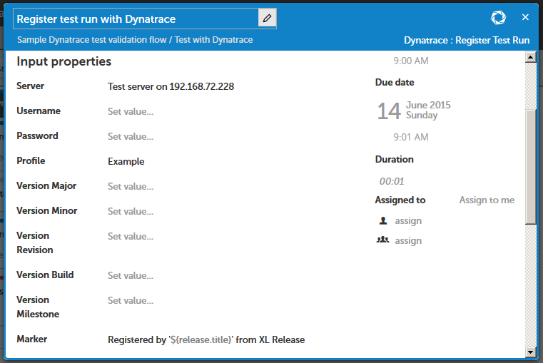
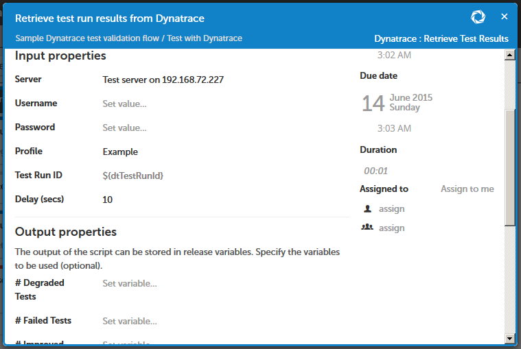
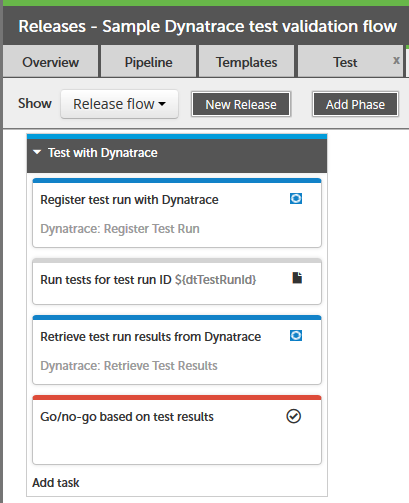

#XL Release Dynatrace Plugin

## Preface
This document descripts the functionality provide by the `xlr-dynatrace-plugin`, as well as potential future functionality.

## Overview
In addition to being a monitoring tool, Dynatrace can be used to collect data during testing. This plugin allows users to query Dynatrace's enhanced test results from XL Release to make decisions about whether or not to continue with a release.

## Supported Tasks
The plugin currently supports two tasks:

* [Register test run](https://community.compuwareapm.com/community/pages/viewpage.action?pageId=182356997#SystemProfiles%28REST%29-TestAutomation)
* [Retrieve test results](https://community.compuwareapm.com/community/pages/viewpage.action?pageId=182356997#SystemProfiles%28REST%29-TestAutomation)

#### Register test run

Registers a test run with Dynatrace and returns the test run ID. This ID needs to be passed to the test tool(s).

**Input properties**

* `dynatraceServer`: The Dynatrace server with which the test run should be registered. _Required_
* `username`: The username to use to log in to the Dynatrace server. If not set, the username configured on the Dynatrace server configuration CI will be used. _Optional_
* `password`: The password to use to log in to the Dynatrace server. If not set, the password configured on the Dynatrace server configuration CI will be used. _Optional_
* `profile`: The system profile in Dynatrace against which the test run should be registered. _Required_
* `versionMajor`: See the [Dynatrace documentation](https://community.compuwareapm.com/community/pages/viewpage.action?pageId=182356997#SystemProfiles%28REST%29-TestAutomation). _Optional_
* `versionMinor`: See the [Dynatrace documentation](https://community.compuwareapm.com/community/pages/viewpage.action?pageId=182356997#SystemProfiles%28REST%29-TestAutomation). _Optional_
* `versionRevision`: See the [Dynatrace documentation](https://community.compuwareapm.com/community/pages/viewpage.action?pageId=182356997#SystemProfiles%28REST%29-TestAutomation). _Optional_
* `versionBuild`: See the [Dynatrace documentation](https://community.compuwareapm.com/community/pages/viewpage.action?pageId=182356997#SystemProfiles%28REST%29-TestAutomation). _Optional_
* `versionMilestone`: See the [Dynatrace documentation](https://community.compuwareapm.com/community/pages/viewpage.action?pageId=182356997#SystemProfiles%28REST%29-TestAutomation). _Optional_
* `marker`: See the [Dynatrace documentation](https://community.compuwareapm.com/community/pages/viewpage.action?pageId=182356997#SystemProfiles%28REST%29-TestAutomation). _Optional_
* `category`: See the [Dynatrace documentation](https://community.compuwareapm.com/community/pages/viewpage.action?pageId=182356997#SystemProfiles%28REST%29-TestAutomation). The default value is 'unit'. _Required_
* `platform`: See the [Dynatrace documentation](https://community.compuwareapm.com/community/pages/viewpage.action?pageId=182356997#SystemProfiles%28REST%29-TestAutomation). _Optional_
* `loadTestName`: See the [Dynatrace documentation](https://community.compuwareapm.com/community/pages/viewpage.action?pageId=182356997#SystemProfiles%28REST%29-TestAutomation). _Optional_
* `agentGroup`: See the [Dynatrace documentation](https://community.compuwareapm.com/community/pages/viewpage.action?pageId=182356997#SystemProfiles%28REST%29-TestAutomation). _Optional_

**Output properties**

* `testRunId`: The ID of the test run returned by the Dynatrace server.

#### Retrieve test results

Attempts to retrieve the results of a given test run ID from Dynatrace. By default, the task will wait 10s before calling Dynatrace, to give the Dynatrace server sufficient time to process monitoring data collected from the last test runs.

**Input properties**

* `dynatraceServer`: The Dynatrace server with which the test run should be registered. _Required_
* `username`: The username to use to log in to the Dynatrace server. If not set, the username configured on the Dynatrace server configuration CI will be used. _Optional_
* `password`: The password to use to log in to the Dynatrace server. If not set, the password configured on the Dynatrace server configuration CI will be used. _Optional_
* `profile`: The system profile in Dynatrace against which the test run should be registered. _Required_
* `testRunId`: The ID of the test run for which results should be retrieved. _Required_
* `delay`: The number of seconds to wait before calling the Dynatrace server. This gives the server time to process input from the last tests, even if this task is started immediately after the tests have completed. The default value is 10. _Required_

**Output properties**

* `numDegradedTests`: See the [Dynatrace documentation](https://community.compuwareapm.com/community/pages/viewpage.action?pageId=182356997#SystemProfiles%28REST%29-TestAutomation).
* `numFailedTests`: See the [Dynatrace documentation](https://community.compuwareapm.com/community/pages/viewpage.action?pageId=182356997#SystemProfiles%28REST%29-TestAutomation).
* `numImprovedTests`: See the [Dynatrace documentation](https://community.compuwareapm.com/community/pages/viewpage.action?pageId=182356997#SystemProfiles%28REST%29-TestAutomation).
* `numInvalidatedTests`: See the [Dynatrace documentation](https://community.compuwareapm.com/community/pages/viewpage.action?pageId=182356997#SystemProfiles%28REST%29-TestAutomation).
* `numPassedTests`: See the [Dynatrace documentation](https://community.compuwareapm.com/community/pages/viewpage.action?pageId=182356997#SystemProfiles%28REST%29-TestAutomation).
* `numVolatileTests`: See the [Dynatrace documentation](https://community.compuwareapm.com/community/pages/viewpage.action?pageId=182356997#SystemProfiles%28REST%29-TestAutomation).
* `testResults`: The test results returned by the Dynatrace server, in the format described in the [Dynatrace documentation](https://community.compuwareapm.com/community/pages/viewpage.action?pageId=182356997#SystemProfiles%28REST%29-TestAutomation).

## Usage
The intended use case for this plugin is to support Dynatrace's ability to monitor runs of unit, UI, load, performance and API tests and provide information about architectural and other metrics that are relevant to go/no-go decisions.

The plugin allows you to retrieve this information from Dynatrace for review or, if desired, an automated decision. The plugin does **not** at present provide any tasks to make such decisions.

Note that Dynatrace is not aware of whether a test run has been completed or is still in progress - the call to retrieve tests results will simply return the data available at that moment. You will need to ensure that you set up your template or release so that Dynatrace is not called until the tests you are running have been completed.

## Example
The canonical flow here involves registering a new test run with Dynatrace and passing the test run ID that is returned to one or more invocations of test tools, either by invoking the test tool directly, or e.g. as a parameter to a Jenkins build.

You would then retrieve the test results from Dynatrace and either review them manually, using e.g. a Gate task, or use a Script task to automatically determine whether to stop or continue.

